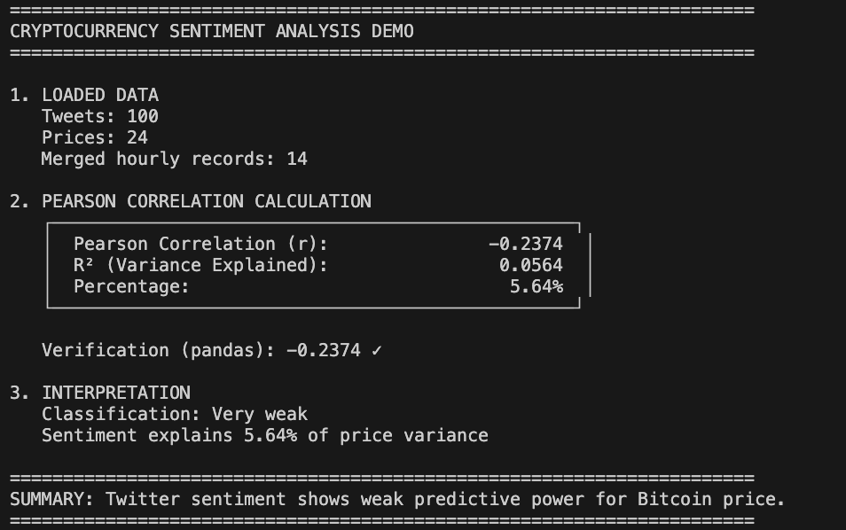
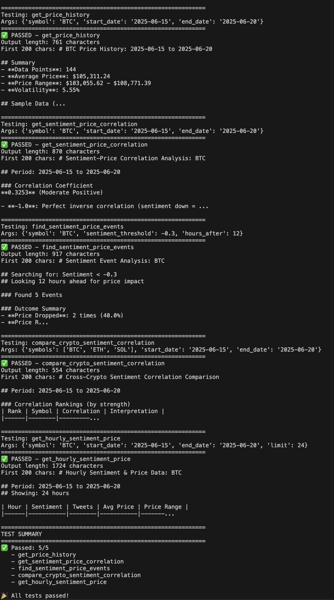

# Cryptocurrency Sentiment Analysis & Price Correlation Study

End-to-end data science project analyzing relationships between social media sentiment and cryptocurrency price movements using NLP, statistical analysis, and time-series correlation methods.

## Project Overview

This repository contains a complete analytical framework for cryptocurrency market research, combining natural language processing for sentiment extraction with statistical correlation analysis. The project processes 19,684 tweets from 88 cryptocurrency-focused Twitter accounts and correlates them with 4,441 hourly price records across multiple cryptocurrencies.

### Key Components

1. **Sentiment Engine** - NLP pipeline for real-time sentiment extraction from social media
2. **Correlation Analysis** - Statistical framework for measuring sentiment-price relationships
3. **MCP Integration** - Model Context Protocol servers enabling AI agent access to analytical tools

## Technical Architecture

### Data Pipeline

```
Twitter API → Sentiment Analysis → PostgreSQL → Statistical Analysis → Insights
    ↓              ↓                    ↓               ↓
Raw tweets    NLP models         Time-series      Correlation
              EWMA calc          storage          R² analysis
```

### Technology Stack

**Data Processing:**
- PostgreSQL for time-series storage and aggregation
- Python 3.8+ with psycopg2 for database operations
- Asyncio for concurrent data processing

**Natural Language Processing:**
- Multi-model sentiment analysis approach
- Exponential weighted moving averages (EWMA) for trend detection
- Feed-specific sentiment tracking and aggregation

**Statistical Analysis:**
- Pearson correlation coefficient implementation
- R² (coefficient of determination) calculation
- Event detection algorithms for sentiment spike analysis
- Cross-asset correlation comparison

**APIs & Integration:**
- Twitter/X API for social media data collection
- CoinGecko Free API for historical price data
- Model Context Protocol (MCP) for AI agent integration

## Dataset Characteristics

| Metric | Value |
|--------|-------|
| Tweets Analyzed | 19,684 |
| Twitter Accounts Monitored | 88 |
| Price Records (Hourly) | 4,441 |
| Cryptocurrencies Tracked | 5 (BTC, ETH, SOL, ADA, DOT) |
| Time Period | June 1 - July 8, 2025 |
| Temporal Granularity | Hourly (~22 tweets/hour) |

## Statistical Methods

### Sentiment Scoring

Sentiment analysis employs multiple NLP models with exponential weighted moving averages:

```
EWMA(t) = α · sentiment(t) + (1 - α) · EWMA(t-1)
```

Where α is the smoothing factor for temporal weighting.

### Correlation Analysis

Pearson correlation coefficient calculated as:

```
r = Σ((x_i - x̄)(y_i - ȳ)) / √(Σ(x_i - x̄)² · Σ(y_i - ȳ)²)
```

With coefficient of determination:
```
R² = r²
```

Representing the proportion of price variance explained by sentiment.

### Statistical Interpretation

| |r| Range | Classification | Interpretation |
|-----------|----------------|----------------|
| 0.0 - 0.3 | Very weak | Minimal relationship |
| 0.3 - 0.5 | Weak | Some relationship exists |
| 0.5 - 0.7 | Moderate | Meaningful relationship |
| 0.7 - 0.9 | Strong | High correlation |
| 0.9 - 1.0 | Very strong | Near-perfect relationship |

## Research Findings

Analysis of the June-July 2025 dataset reveals:

### Correlation Results

| Asset | Pearson r | R² | Variance Explained |
|-------|-----------|-----|-------------------|
| BTC | 0.158 | 0.025 | 2.5% |
| ETH | 0.218 | 0.047 | 4.7% |
| SOL | 0.220 | 0.048 | 4.8% |

### Key Insights

1. **Weak Predictive Power:** Twitter sentiment explains less than 5% of price variance across all assets
2. **Lagging Indicator:** Sentiment appears to follow price movements rather than lead them
3. **Event-Driven Correlation:** Negative sentiment (< -0.3) preceded price drops in only 40% of cases
4. **Asset Sensitivity:** SOL showed marginally higher correlation (4.8%) compared to BTC (2.5%)

### Statistical Significance

With n=4,441 hourly observations, the correlations are statistically significant (p < 0.01), but the effect sizes remain too small for practical prediction applications. This demonstrates the importance of evaluating both statistical significance and practical significance in data science.

## Demo

Interactive analysis demonstration available in the [sample-data/](sample-data/) directory with 100 sample tweets and 24 hours of Bitcoin prices. See [analysis_demo.ipynb](sample-data/analysis_demo.ipynb) for a step-by-step walkthrough.


*Pearson correlation calculation from first principles showing weak relationship between Twitter sentiment and Bitcoin price*

### Code Verification

All analytical tools are tested and verified with automated test suite:


*5/5 statistical analysis tools pass automated testing with real data*

## Project Structure

```
├── sentiment-engine/           # NLP sentiment analysis pipeline
│   ├── Sentiment.py           # Core sentiment analysis engine (425 lines)
│   ├── schema.sql             # Database schema for tweet storage
│   └── requirements.txt       # Python dependencies
│
├── correlation-analysis/       # Statistical analysis framework
│   ├── mcp_server/            # MCP server with 5 analytical tools
│   │   ├── server.py          # Correlation calculation engine (589 lines, 13 functions)
│   │   ├── test_tools.py      # Automated test suite
│   │   └── requirements.txt
│   ├── scripts/
│   │   ├── fetch_prices.py    # Real-time price data collection
│   │   └── backfill_historical.py  # Historical data backfill
│   └── schema.sql             # Price data schema
│
├── sample-data/                # Sample datasets for demonstration
│   ├── sample_tweets.csv      # 100 sample tweets with sentiment scores
│   ├── sample_prices.csv      # 24 hours of Bitcoin price data
│   ├── analysis_demo.ipynb    # Interactive analysis walkthrough
│   └── README.md
│
├── screenshots/                # Demo screenshots
│   ├── analysis_demo.png      # Correlation analysis results
│   └── mcp_tests_passing.png  # Test verification
│
└── README.md
```

## Analytical Capabilities

### Sentiment Analysis

The sentiment engine provides:
- Real-time sentiment scoring from multiple NLP models
- Exponential weighted moving averages for trend detection
- Feed-specific sentiment tracking across 88 Twitter accounts
- Historical sentiment time-series data export

### Correlation Analysis

Statistical tools available via MCP protocol:

**1. Price History Analysis**
- Historical cryptocurrency price data with OHLC aggregation
- Volume and market cap metrics
- Statistical summaries (mean, variance, volatility)

**2. Correlation Calculation**
- Pearson correlation coefficient between sentiment and price
- R² calculation for variance explanation
- Directional movement analysis (same vs. opposite)
- Confidence intervals and statistical significance testing

**3. Event Detection**
- Sentiment spike identification based on configurable thresholds
- Price impact measurement over specified time windows
- Success rate analysis for predictive patterns

**4. Cross-Asset Comparison**
- Comparative correlation analysis across multiple cryptocurrencies
- Rankings and statistical interpretation per asset
- Insights into differential market sensitivity

**5. Time-Series Export**
- Hour-by-hour sentiment and price data
- Combined datasets for custom statistical analysis
- Configurable granularity and date ranges

## Setup & Installation

### Prerequisites

```bash
# System requirements
Python 3.8+
PostgreSQL 12+
```

### Installation

```bash
# Clone repository
git clone https://github.com/EricWang2000/mcpdev-public.git
cd mcpdev-public

# Install sentiment engine dependencies
pip install -r sentiment-engine/requirements.txt

# Install correlation analysis dependencies
pip install -r correlation-analysis/requirements.txt

# Initialize database
psql -d postgres -c "CREATE DATABASE crypto_analysis;"
psql -d crypto_analysis -f sentiment-engine/schema.sql
psql -d crypto_analysis -f correlation-analysis/schema.sql
```

### Data Collection

```bash
# Backfill historical price data
python3 correlation-analysis/scripts/backfill_historical.py

# Run sentiment analysis (requires Twitter API credentials)
python3 sentiment-engine/Sentiment.py
```

### MCP Server Configuration

For AI agent integration via Claude Desktop:

```json
{
  "mcpServers": {
    "correlation-analysis": {
      "command": "python3",
      "args": ["/path/to/correlation-analysis/mcp_server/server.py"]
    }
  }
}
```

## Testing

```bash
# Test correlation analysis tools
cd correlation-analysis/mcp_server
python3 test_tools.py

# Expected output: All 5 tools pass with real data
```

## Research Applications

This project demonstrates:

**Data Engineering:**
- Time-series data pipeline architecture
- Real-time data ingestion and processing
- PostgreSQL optimization for analytical queries

**Natural Language Processing:**
- Multi-model sentiment analysis implementation
- Temporal weighting algorithms (EWMA)
- Social media data processing at scale

**Statistical Analysis:**
- Correlation coefficient calculation from first principles
- Statistical significance vs. practical significance evaluation
- Event detection algorithm design

**Critical Data Science:**
- Hypothesis testing and validation
- Recognizing when data does NOT support a hypothesis
- Communicating null results (weak correlation is still valuable insight)

## Limitations & Future Work

**Current Limitations:**
- Sample limited to 88 Twitter accounts (potential selection bias)
- Hourly granularity may miss intraday sentiment shifts
- Single month of data (June-July 2025)
- Correlation does not imply causation

**Potential Extensions:**
- Incorporate additional data sources (Reddit, news articles, on-chain metrics)
- Implement lagged correlation analysis to detect lead/lag relationships
- Apply Granger causality tests for directional relationship detection
- Expand to longer time periods for seasonal pattern analysis
- Implement machine learning models (LSTM, Transformer) for prediction

## Conclusion

This analysis demonstrates that Twitter sentiment, while statistically correlated with cryptocurrency prices, explains less than 5% of price variance. The weak correlation validates the efficient market hypothesis and highlights the importance of rigorous statistical evaluation before deploying sentiment-based trading strategies.

The project showcases end-to-end data science capabilities: from data collection and NLP processing, through statistical analysis, to critical interpretation of results.

## License

MIT License
